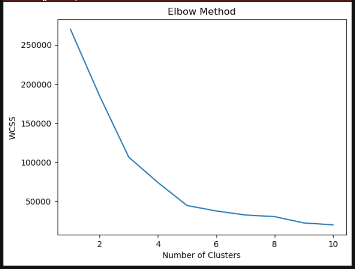

# Implementation-of-K-Means-Clustering-for-Customer-Segmentation

## AIM:
To write a program to implement the K Means Clustering for Customer Segmentation.

## Equipments Required:
1. Hardware – PCs
2. Anaconda – Python 3.7 Installation / Jupyter notebook

## Algorithm
1. Import necessary libraries and load the dataset (Mall_Customers.csv) using pandas.
2. Display dataset structure, first few rows, and check for missing values.
3. Use the Elbow Method by fitting KMeans with 1 to 10 clusters and plotting WCSS to find the optimal number.
4. Apply KMeans clustering with the chosen number of clusters (e.g., 5) to the relevant features.
5. Predict cluster labels for each customer and add them to the dataset as a new column.
6. Filter the dataset into separate DataFrames for each cluster.
7. Plot each cluster using a scatter plot to visualize customer segments based on income and spending.

## Program:
```
/*
Program to implement the K Means Clustering for Customer Segmentation.
Developed by: Nanda Kishor S P
RegisterNumber: 212224040210
*/
```

```python
# importing necessary libraries
import pandas as pd
import matplotlib.pyplot as plt
```

```python
# load the dataset
data = pd.read_csv('Mall_Customers.csv')
```

```python
# display first five records
data.head()
```

```python
# display dataframe information
data.info()
```

```python
# display the count of null values in each column
data.isnull().sum()
```

```python
# using Elbow Method to determine optimal number of clusters
from sklearn.cluster import KMeans
# within-cluster sum of squares
wcss = []

for i in range(1, 11):
    kmeans = KMeans(n_clusters=i, init="k-means++")
    # using 'Annual Income' and 'Spending Score'
    kmeans.fit(data.iloc[:, 3:])
    wcss.append(kmeans.inertia_)

# plot the Elbow graph
plt.plot(range(1, 11), wcss)
plt.xlabel("Number of Clusters")
plt.ylabel("WCSS")
plt.title("Elbow Method")
plt.show()
```

```python
# fitting KMeans to the data with 5 clusters
km = KMeans(n_clusters=5)
km.fit(data.iloc[:, 3:])
```

```python
# predicting cluster labels for each record
y_pred = km.predict(data.iloc[:, 3:])
y_pred
```

```python
# adding predicted cluster labels to the dataframe
data["cluster"] = y_pred
```

```python
# splitting data into clusters for visualization
df0 = data[data["cluster"] == 0]
df1 = data[data["cluster"] == 1]
df2 = data[data["cluster"] == 2]
df3 = data[data["cluster"] == 3]
df4 = data[data["cluster"] == 4]
```

```python
# visualizing customer segments using scatter plot
plt.scatter(df0["Annual Income (k$)"], df0["Spending Score (1-100)"], c="red", label="cluster0")
plt.scatter(df1["Annual Income (k$)"], df1["Spending Score (1-100)"], c="black", label="cluster1")
plt.scatter(df2["Annual Income (k$)"], df2["Spending Score (1-100)"], c="blue", label="cluster2")
plt.scatter(df3["Annual Income (k$)"], df3["Spending Score (1-100)"], c="green", label="cluster3")
plt.scatter(df4["Annual Income (k$)"], df4["Spending Score (1-100)"], c="magenta", label="cluster4")
plt.legend()
plt.title("Customer Segments")
plt.show()
```


## Output:

### DataFrame Head Values
  

### DataFrame Info
  

### Sum of Null Values
  

### Plotting the Elbow Graph
  

### Training the Model
  

### Predicting Cluster Labels
  

### Visualizing Customer Labels
  


## Result:
Thus the program to implement the K Means Clustering for Customer Segmentation is written and verified using python programming.
